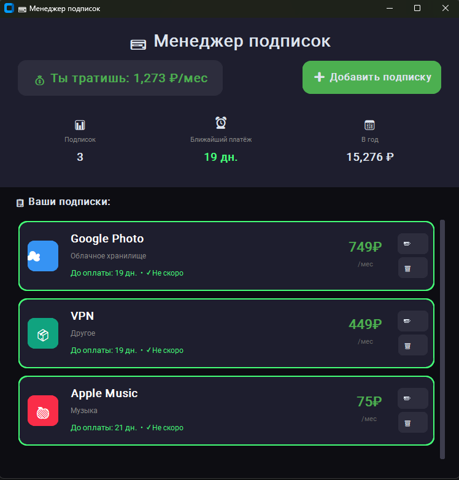
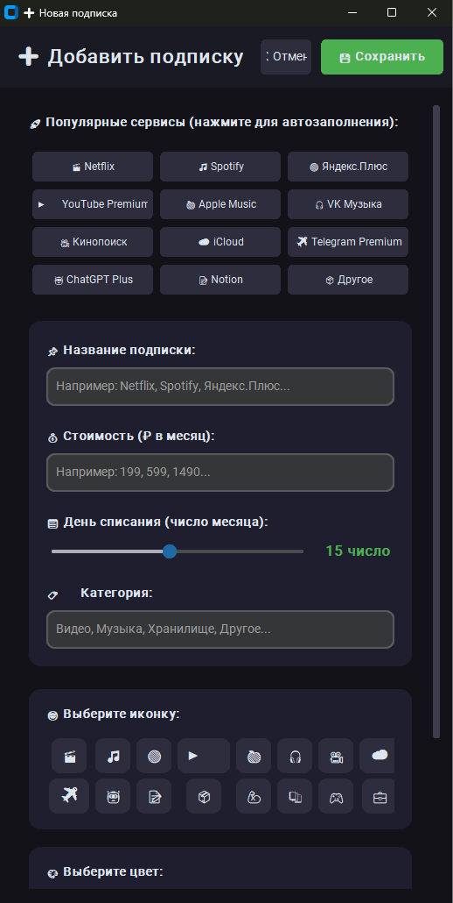

<div align="center">

# 💳 Менеджер подписок (Subscription Tracker)

### Стильное приложение для отслеживания ваших подписок и контроля расходов


**[Возможности](#-возможности) • [Установка](#-установка) • [Использование](#-использование) • [Скриншоты](#-скриншоты)**

</div>

---

## 📋 О проекте

**Менеджер подписок** — это современное десктопное приложение с красивым тёмным интерфейсом, которое помогает отслеживать все ваши платные подписки (Netflix, Spotify, Яндекс.Плюс и другие), контролировать расходы и не пропускать даты списания.

### 🤔 Зачем это нужно?

- 💸 Знаете ли вы, сколько тратите на подписки в месяц?
- 📅 Часто забываете о неожиданных списаниях?
- 🗂️ Хотите видеть все подписки в одном месте?

**Subscription Tracker** решает все эти проблемы!

---

## ✨ Возможности

### 🎯 Основные функции

| Функция | Описание |
|---------|----------|
| ➕ **Добавление подписок** | Быстрое добавление с пресетами популярных сервисов |
| 💰 **Общая статистика** | Мгновенный подсчёт месячных и годовых расходов |
| ⏰ **Умные напоминания** | Цветовая индикация приближающихся платежей |
| ✏️ **Редактирование** | Изменение любых параметров подписки |
| 🗑️ **Удаление** | Удаление подписок одним кликом |
| 💾 **Автосохранение** | Данные сохраняются в JSON-файл автоматически |
| 🎨 **Кастомизация** | Выбор иконок и цветов для каждой подписки |

### 🚦 Система уведомлений

Приложение подсвечивает подписки разными цветами в зависимости от срочности:

| Цвет | Статус | Дней до оплаты |
|------|--------|----------------|
| 🔴 **Красный** | Срочно! | 1–3 дня |
| 🟠 **Оранжевый** | На этой неделе | 4–7 дней |
| 🟢 **Зелёный** | Не скоро | 8+ дней |

### 📱 Готовые пресеты сервисов

- 🎬 Netflix
- 🎵 Spotify
- 🔴 Яндекс.Плюс
- ▶️ YouTube Premium
- 🍎 Apple Music
- 🎧 VK Музыка
- 🎥 Кинопоиск
- ☁️ iCloud
- ✈️ Telegram Premium
- 🤖 ChatGPT Plus
- 📝 Notion  
- И другие...

---

## 🖼️ Скриншоты

### Главное окно

```



```

### Диалог добавления подписки

```



````

---

## 🚀 Установка

### Требования

- Python 3.8+
- Windows / macOS / Linux

### Шаг 1: Клонирование

```bash
git clone https://github.com/yourusername/subscription-tracker.git
cd subscription-tracker
````

### Шаг 2: Виртуальное окружение

**Windows**

```bash
python -m venv venv
venv\Scripts\activate
```

**macOS / Linux**

```bash
python3 -m venv venv
source venv/bin/activate
```

### Шаг 3: Установка зависимостей

```bash
pip install -r requirements.txt
```

Или вручную:

```bash
pip install customtkinter
```

### Шаг 4: Запуск

```bash
python main.py
```

---

## 📦 requirements.txt

```
customtkinter>=5.2.0
```

---

## 📁 Структура проекта

```
subscription-tracker/
│
├── main.py
├── requirements.txt
├── README.md
├── LICENSE
│
├── screenshots/
│   ├── main.png
│   ├── add_dialog.png
│   └── demo.gif
│
└── subscriptions.json
```

---

## 💾 Формат данных

```json
{
  "next_id": 4,
  "subscriptions": [
    {
      "id": 1,
      "name": "Netflix",
      "price": 899.0,
      "billing_day": 15,
      "category": "Видео",
      "color": "#E50914",
      "icon": "🎬"
    },
    {
      "id": 2,
      "name": "Spotify",
      "price": 199.0,
      "billing_day": 1,
      "category": "Музыка",
      "color": "#1DB954",
      "icon": "🎵"
    }
  ]
}
```

---

## 🎮 Использование

### Добавление подписки

1. Нажмите «➕ Добавить подписку»
2. Выберите пресет или заполните вручную
3. Название, стоимость, дата списания, категория, иконка, цвет
4. Нажмите «💾 Сохранить»

### Редактирование

1. Нажмите «✏️»
2. Измените параметры
3. Сохраните

### Удаление

Нажмите «🗑️»

---

## 🛠️ Технологии

| Технология    | Назначение      |
| ------------- | --------------- |
| Python        | Основной язык   |
| CustomTkinter | UI фреймворк    |
| JSON          | Хранение данных |

---

## 🗺️ Roadmap

### 1.1

* 🔔 Уведомления
* 📊 Графики
* 🏷️ Фильтры

### 1.2

* 💱 Валюты
* 📤 CSV/Excel
* 📥 Импорт

### 2.0

* ☁️ Облако
* 📱 Мобильное приложение
* 👥 Семейный аккаунт

---

## 🤝 Вклад

```bash
git checkout -b feature/amazing-feature
git commit -m "✨ Добавлена крутая функция"
git push origin feature/amazing-feature
```

---

## 🐛 Проблемы

| Проблема                            | Статус | Решение                 |
| ----------------------------------- | ------ | ----------------------- |
| Эмодзи не отображаются на Windows 7 | ⚠️     | Используйте Windows 10+ |
| Маленький шрифт на 4K               | 🔄     | Масштабирование ОС      |

---

## ❓ FAQ

<details>
<summary><b>Где хранятся данные?</b></summary>
В файле subscriptions.json.
</details>

<details>
<summary><b>Как перенести данные?</b></summary>
Перенести subscriptions.json.
</details>

<details>
<summary><b>Не запускается?</b></summary>
Проверьте Python 3.8+ и customtkinter.
</details>

<details>
<summary><b>Можно добавить пресеты?</b></summary>
Да, в PRESETS в main.py.
</details>

---

## 📄 Лицензия (MIT)

```
MIT License
Copyright...
```

---

## 👨‍💻 Автор

<div align="center">

mas562
GitHub · Telegram · Email

</div>

---

<div align="center">

⭐ Если проект понравился — поставьте звезду!
🎉 Спасибо за использование!
Сделано с ❤️ и Python

</div>
```

---


